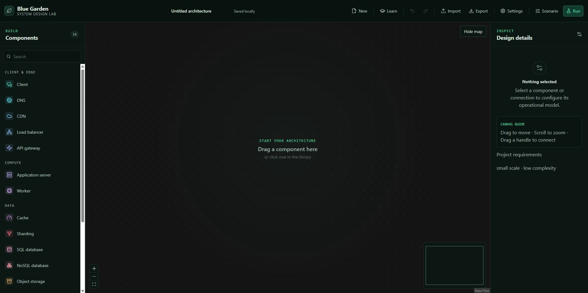
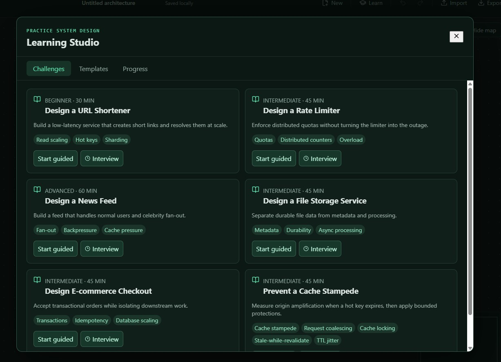
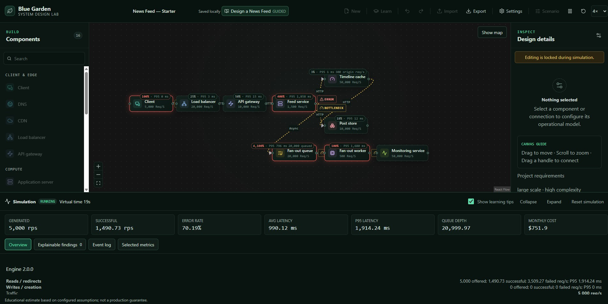
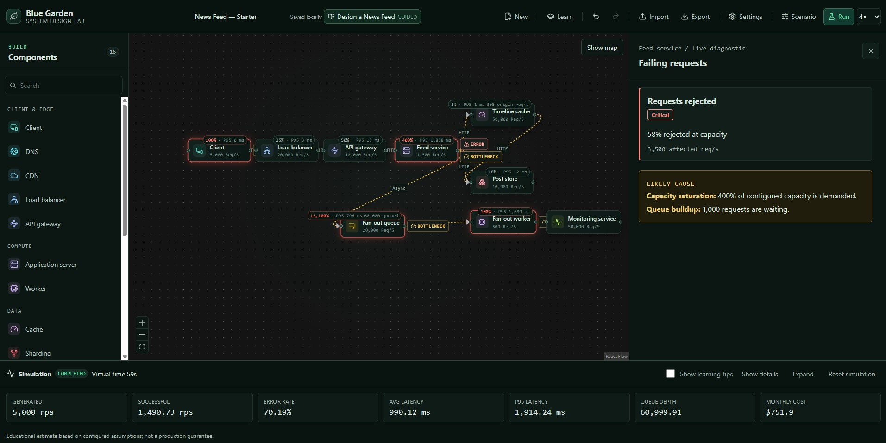

# Blue Garden

> An interactive system-design laboratory for building architectures, simulating failure, and learning from the results.

Blue Garden is a local-first browser application that turns system design into an executable learning loop:

**Build → Configure → Simulate → Diagnose → Improve → Compare**

Instead of drawing a static diagram, you model a system with typed components, run configurable traffic scenarios, inspect bottlenecks, and use guided exercises to develop stronger architecture instincts.

## Preview

### Build an architecture

<p align="center">
  
</p>

### Practice in Learning Studio

<p align="center">
  
</p>

### Run a scenario and inspect live metrics

<p align="center">
  
</p>

### Diagnose failures and bottlenecks

<p align="center">
  
</p>

## What you can do

### Model

- Compose architectures on an infinite React Flow canvas.
- Switch between light and dark blue themes, and hide either sidebar to make more room for the canvas.
- Auto-arrange connected nodes from left to right with consistent spacing and one-step undo.
- Choose from 16 typed system components, including clients, gateways, caches, queues, databases, workers, sharding routers, and monitoring services.
- Configure operational behavior through Basic and Advanced inspector panels.
- Create, reconnect, label, reverse, duplicate, monitor, disable, and disconnect directed connections.
- Save typed project requirements and receive advisory architecture feedback.

### Simulate

- Run deterministic, aggregate browser simulations in a cancellable Web Worker.
- Configure baseline traffic and incident scenarios such as traffic spikes, node failures, capacity pressure, latency, retries, queue injection, cache bypass, and cache-key expiration.
- Explore capacity, throughput, latency, queue backlog, cache behavior, sharding, failure, retry amplification, and estimated cost.
- Control presentation speed at `1×`, `4×`, `16×`, or `MAX` while keeping the underlying run deterministic.
- Follow live canvas overlays, KPI timelines, event logs, and explainable bottleneck findings.
- Resize the results panel by dragging its upper edge or using the keyboard; workspace preferences are remembered locally.

### Learn

- Work through guided challenges and interview-style practice sessions.
- Use six editable learning templates, including URL Shortener, Rate Limiter, News Feed, File Storage, E-commerce Checkout, and Cache Stampede exercises.
- See contextual concepts, questions, learning tips, capacity worksheets, and semantic incidents.
- Compare submitted and curated reference architectures as neutral evidence rather than receiving a simplistic score.

### Persist and iterate

- Autosave projects locally with IndexedDB through Dexie.
- Import and export validated JSON architecture documents.
- Keep simulation runs and learning attempts separate from the canonical architecture document.
- Migrate supported legacy architecture schemas safely before loading them into the editor.
- Use transactional undo/redo with coalesced continuous input.

## Engineering highlights

Blue Garden is designed as a product-sized frontend exercise, not just a canvas demo:

- **Domain model first:** the persisted `ArchitectureDocumentV1` contract is independent of React Flow, so the renderer is not the source of truth.
- **Explicit boundaries:** React UI, Zustand state, the typed domain model, IndexedDB persistence, and the simulation Worker communicate through focused interfaces.
- **Validated data:** Zod schemas enforce graph invariants, configuration rules, scenario references, and migration behavior.
- **Deterministic execution:** the simulation engine uses aggregate expected values to make high-volume scenarios fast, repeatable, and explainable.
- **Evidence-oriented learning:** diagnostics and comparisons expose trade-offs without pretending that one architecture is universally correct.
- **Tested behavior:** the project includes domain, engine, component/store, and Playwright end-to-end tests.

## Technology

| Area                 | Tools                               |
| -------------------- | ----------------------------------- |
| UI                   | React 19, TypeScript                |
| Build                | Vite                                |
| Architecture canvas  | `@xyflow/react` / React Flow        |
| Client state         | Zustand                             |
| Validation           | Zod                                 |
| Local persistence    | Dexie + IndexedDB                   |
| Simulation isolation | Native module Web Worker            |
| Testing              | Vitest, Testing Library, Playwright |
| Quality              | ESLint, Prettier, strict TypeScript |

## Run locally

Requirements: Node.js 22+ and npm.

```bash
npm install
npm run dev
```

Vite prints the local development URL in the terminal.

## Quality commands

```bash
npm run lint
npm test
npm run test:e2e
npm run build
npm run format:check
```

## Editor shortcuts

| Action                     | Windows/Linux              | macOS                   |
| -------------------------- | -------------------------- | ----------------------- |
| Undo                       | `Ctrl+Z`                   | `Cmd+Z`                 |
| Redo                       | `Ctrl+Y` or `Ctrl+Shift+Z` | `Cmd+Shift+Z`           |
| Open component information | `I`                        | `I`                     |
| Close information          | `Escape`                   | `Escape`                |
| Delete selection           | `Delete` or `Backspace`    | `Delete` or `Backspace` |

## Project boundaries

The current application runs entirely in the browser. It does not currently include accounts, a backend, cloud provisioning, collaboration, remote project storage, or AI grading. Simulation output is an educational estimate based on configured assumptions, not a production capacity guarantee.

Some editor capabilities remain on the roadmap, including full region containment, multi-select workflows, general clipboard behavior, and comprehensive mobile editing.

## Documentation

- [System overview](docs/architecture/00-system-overview.md)
- [Runtime architecture](docs/architecture/01-runtime-architecture.md)
- [Domain model and schema](docs/architecture/02-domain-model-and-schema.md)
- [Editor, UI, and state](docs/architecture/03-editor-ui-and-state.md)
- [Simulation engine](docs/architecture/04-simulation-engine.md)
- [Learning Studio](docs/architecture/05-learning-studio.md)
- [Persistence and data lifecycle](docs/architecture/06-persistence-and-data-lifecycle.md)
- [Testing and quality](docs/architecture/08-testing-and-quality.md)
- [Architecture decision records](docs/decisions/README.md)
- [System-design interview reference material](docs/DesignInterv/README.md)

## License

This project is currently a private portfolio project.
