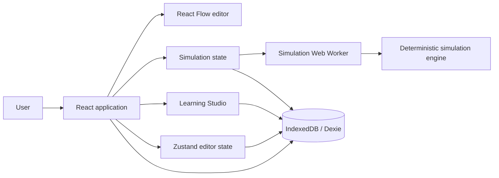

# Current System Overview

Last synchronized with source: **6 September 2026**

## 1. Product definition

Blue Garden is a local-first, browser-based **system-design learning laboratory**. It combines a structured architecture editor, a deterministic traffic simulator, explainable diagnostics, and a Learning Studio that guides users through system-design exercises.

The product loop implemented today is:

**Build → Configure → Simulate → Diagnose → Improve → Compare**

The canvas is an interaction surface for a structured domain model. The product is not designed as a generic diagram editor and the simulator is not a production capacity planner.

## 2. Current deployment boundary

The entire application runs in the browser.



There is currently no backend, authentication, account system, remote project store, collaboration service, or LLM dependency.

## 3. Primary runtime technologies

| Concern | Technology |
| --- | --- |
| UI | React 19 + TypeScript |
| Build/dev server | Vite 8 |
| Canvas | `@xyflow/react` / React Flow |
| Client state | Zustand |
| Runtime validation | Zod |
| Local persistence | Dexie over IndexedDB |
| Simulation isolation | Native module Web Worker |
| Icons | Lucide React |
| Unit/component tests | Vitest + Testing Library |
| Browser tests | Playwright |
| Static quality | ESLint + Prettier + TypeScript |

The package contract is defined in `package.json`.

## 4. Major subsystems

### 4.1 Architecture domain

The canonical model is `ArchitectureDocumentV1` in `src/domain/architecture/types.ts`. The current schema version is `1.4` and is validated/migrated in `src/domain/architecture/schema.ts`.

The canonical document contains:

- project metadata;
- project settings;
- viewport;
- architecture nodes;
- directed architecture edges;
- saved simulation scenarios.

It deliberately contains no React Flow objects, simulation UI state, open panels, diagnostics, or completed run results.

### 4.2 Editor

The editor maps canonical nodes/edges into React Flow objects at the UI boundary. Editor state and transactional history live in `src/features/canvas/editorStore.ts`.

Implemented interaction includes:

- add components by click or drag/drop;
- move and select nodes;
- create/reconnect/delete directed connections;
- edge context operations including reverse, duplicate, monitor, disable, label, and disconnect;
- node and edge inspector configuration;
- undo/redo with transaction coalescing;
- JSON import/export;
- project settings;
- local autosave.

Full multi-selection, general clipboard behavior, and complete Region containment editing remain incomplete.

### 4.3 Simulation

`src/engine/simulationEngine.ts` implements a deterministic, one-second aggregate model. A Web Worker computes the run and emits ticks to the UI at the selected presentation speed.

The engine models educational approximations for:

- demand and capacity;
- queue backlog/overflow;
- processing failures;
- edge latency/timeouts;
- retry amplification;
- synchronous vs asynchronous dependencies;
- cache hits/misses and cache-stampede protections;
- queue delivery;
- sharding distribution;
- throughput, success/error rate, latency, and estimated cost.

### 4.4 Diagnostics

Preflight validation runs before simulation. Runtime diagnostics classify measured problems as errors or bottlenecks and provide structured explanations. Project-level architecture assessment contributes advisory warnings to simulation preflight.

### 4.5 Learning Studio

The Learning Studio provides six current challenge/template families:

- Cache Stampede;
- URL Shortener;
- Distributed Rate Limiter;
- News Feed;
- File Storage Service;
- E-commerce Checkout.

Learning attempts are persisted separately from architecture documents. Challenge incidents target semantic component roles rather than hard-coded node IDs.

### 4.6 Local storage

Dexie database `blue-garden` currently has three logical tables:

- `projects`;
- `simulationRuns`;
- `trainingAttempts`.

Completed simulation runs are retained separately from architecture JSON, with at most ten recent runs per architecture.

## 5. Application composition

`src/app/App.tsx` composes the current top-level surfaces:

```text
TopBar
├─ project actions/settings
├─ Learning Studio entry
└─ SimulationControls

Workspace
├─ ComponentPalette
├─ ArchitectureCanvas
└─ InspectorHost

SimulationPanel
ScenarioDrawer
LearningHub
LearningDrawer
```

The presentation store controls whether narrow/reading layouts prioritize the canvas, component palette, or inspector.

## 6. Architectural principles already encoded in source

1. **Canonical model first.** React Flow is not the persistence contract.
2. **Validate before hydrate.** Imported/loaded documents pass through schema parsing and migration.
3. **Local-first execution.** Core editing, simulation, and learning work without a backend.
4. **Determinism over fake precision.** Simulations use aggregate expected values instead of stochastic request-level emulation.
5. **Immutable run input.** A run receives cloned architecture/scenario input; editing is locked while running or paused.
6. **Results are evidence, not truth.** The simulator provides educational estimates based on configured assumptions.
7. **Learning is evidence-oriented.** Current comparison is neutral and does not declare one topology universally correct.
8. **Specialized behavior should be explicit.** Cache, Sharding, Queue, and learning rules have typed semantics rather than relying on labels or visual appearance.

## 7. Current non-goals

The current implementation does not provide:

- production infrastructure emulation;
- probabilistic request-level simulation;
- real cloud-provider resources;
- server-side accounts or projects;
- collaborative editing;
- real sharing/publication despite visibility metadata;
- production observability of the application itself;
- comprehensive mobile editing;
- AI grading/coaching.

## 8. Source map

| Area | Primary source |
| --- | --- |
| App composition | `src/app/App.tsx` |
| Architecture types/schema/migrations | `src/domain/architecture/` |
| Component registry/defaults | `src/domain/components/definitions.ts` |
| Editor/canvas | `src/features/canvas/` |
| Inspector | `src/features/inspector/` |
| Project settings/persistence hooks | `src/features/projects/` |
| Scenarios | `src/features/scenarios/` |
| Simulation types/preflight/diagnostics | `src/domain/simulation/` |
| Engine/worker | `src/engine/` |
| Learning domain/content | `src/domain/learning/` |
| Learning UI/controller | `src/features/learning/` |
| IndexedDB | `src/storage/database.ts` |
| Browser tests | `tests/e2e/` |
