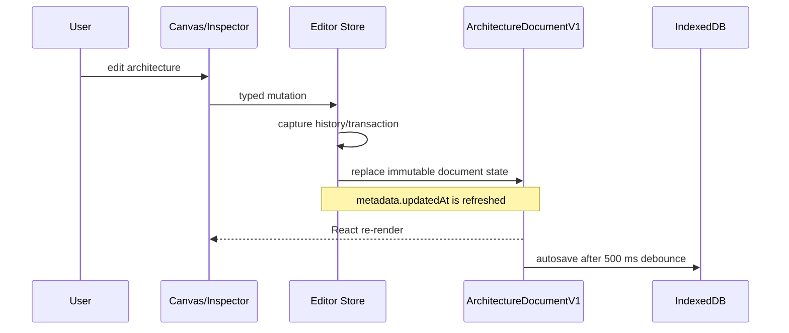
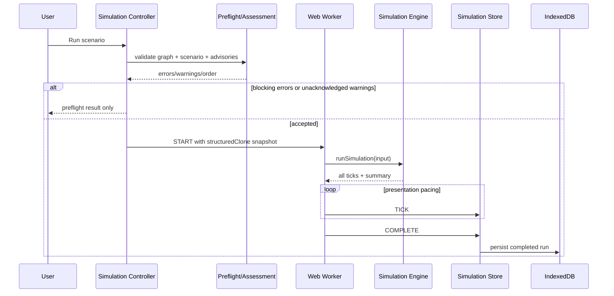
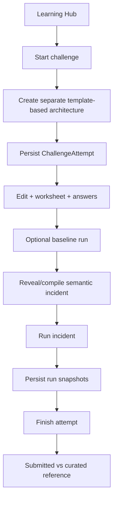

# Runtime Architecture

Last synchronized with source: **6 September 2026**

## 1. Runtime boundaries

Blue Garden currently has five important runtime/state boundaries:

1. **Canonical architecture document** — portable project state.
2. **Editor/UI state** — selection, history, information cards, and reading view.
3. **Simulation state** — run lifecycle, emitted ticks, diagnostics, and speed.
4. **Learning state** — Learning Studio panels, attempts, active attempt, and comparison state.
5. **IndexedDB persistence** — projects, completed runs, and training attempts.

The deterministic simulator executes inside a separate Web Worker, but the underlying engine remains a pure synchronous TypeScript function.

## 2. State ownership

### 2.1 Editor store

`src/features/canvas/editorStore.ts` owns:

- current `ArchitectureDocumentV1`;
- single node/edge selection;
- expanded component information card;
- undo history;
- redo history;
- active transaction base.

Architecture mutations occur here. Project settings and saved scenarios are also mutated through this store so they participate in architecture history.

### 2.2 Simulation store

`src/features/simulation/simulationStore.ts` owns:

- run status;
- run ID;
- active scenario;
- presentation speed;
- emitted ticks;
- final summary;
- preflight result;
- active diagnostic;
- simulation error;
- learning-tip UI preference.

Learning-tip preference is stored in `localStorage` under `blue-garden-learning-tips`; it is not part of project data.

### 2.3 Learning store

`src/features/learning/learningStore.ts` owns:

- Learning Hub open/tab state;
- Learning Drawer state;
- all loaded attempts;
- active attempt;
- loading/error state;
- comparison-running state.

Persisted attempt data itself is stored in IndexedDB.

### 2.4 Presentation store

`src/app/presentationStore.ts` owns only the reading-view choice:

- `canvas`;
- `components`;
- `inspector`.

This keeps layout/navigation state outside the canonical architecture document.

## 3. Editor mutation flow



Continuous edits can use `beginTransaction`/`update*Transient`/`commitTransaction` so a drag or form interaction becomes one undo step instead of many.

Undo/redo retains up to roughly 50 snapshots in each direction. Undo also resolves an uncommitted transaction directly when appropriate.

## 4. Project load/save flow

At application start, `useProjectPersistence`:

1. reads the most recently updated project from IndexedDB;
2. parses it through `parseArchitectureDocument`;
3. migrates legacy schemas when necessary;
4. hydrates the editor store;
5. enables debounced autosave.

Every later canonical document change is saved locally after a 500 ms debounce.

## 5. Import flow

```mermaid
flowchart LR
    File[JSON file] --> Parse[JSON.parse]
    Parse --> Schema[parseArchitectureDocument]
    Schema -->|invalid| Error[Reject import]
    Schema -->|valid/migrated| Clone[Clone document]
    Clone --> NewId[Assign new architecture ID]
    NewId --> Rename[Append '(imported)']
    Rename --> Editor[Replace active project]
```

Import intentionally creates a new architecture identity and timestamps instead of overwriting the source project identity.

## 6. Simulation execution flow



Important nuance: the engine computes the deterministic run before tick playback. Worker speed (`1×`, `4×`, `16×`, `MAX`) controls tick emission/presentation, not simulation mathematics.

`MAX` emits up to 25 ticks per timer turn with zero configured delay. Other speeds emit one tick approximately every `1000 / speed` milliseconds.

## 7. Simulation lock

The editor is considered locked when simulation status is `running` or `paused`.

While locked, destructive/editor mutations exposed through the UI are disabled. The run input itself was already cloned, so the engine is isolated from later object mutation as well.

## 8. Diagnostics flow

After each tick:

1. edge failures/rejections/timeouts are derived from downstream node metrics;
2. edge diagnostics are generated;
3. node diagnostics are generated using current and previous tick state;
4. the canvas derives affected-path visual states by tracing upstream from error/bottleneck nodes;
5. the inspector/diagnostic reading panel exposes explanations and evidence.

Diagnostics are presentation/runtime state and are not written into architecture JSON.

## 9. Learning challenge flow



Challenge start explicitly switches to a separate architecture project. The prior current project is saved before switching.

## 10. Failure and cancellation behavior

- A failed preflight prevents worker creation.
- Worker exceptions become simulation `error` state.
- Reset sends `CANCEL` when a run ID exists, terminates the worker, and clears simulation state.
- Changing architecture projects resets simulation state.
- Learning attempt/project data persists independently of open/closed Learning Studio panels.

## 11. Architectural dependency direction

The intended dependency direction is:

```text
UI/features
    ↓
domain contracts + domain logic
    ↓
storage / engine boundaries
```

The canonical architecture domain must not import React Flow or React UI types. This separation is a foundational invariant.
